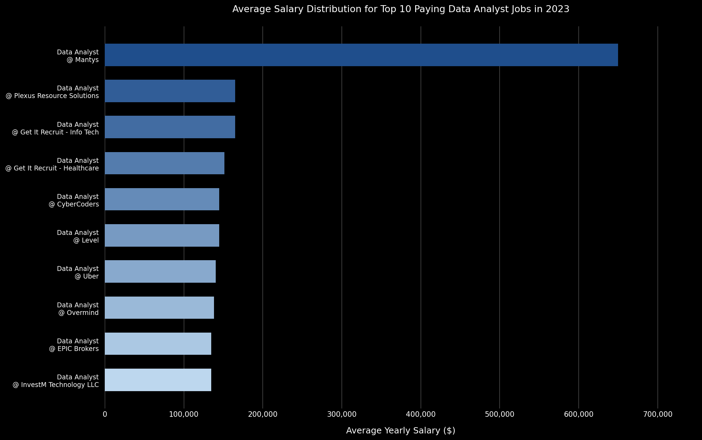
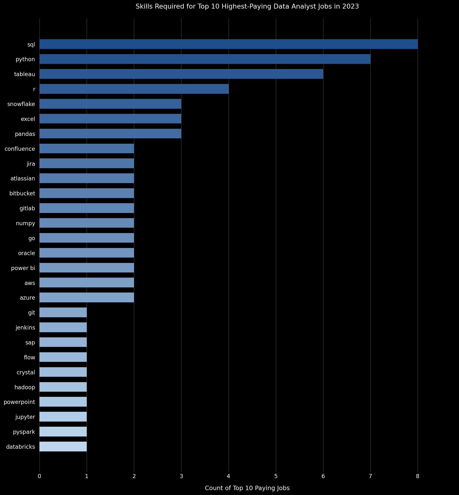

# Introduction
📊 Dive into the data job market! Focusing on remote data analyst roles, 
this project explores 💰 top-paying jobs, 🔥 in-demand skills, and 
📈 where high demand meets high salary in data analytics.

🔍 SQL queries? Check them out here: [project_sql](./project_sql) folder.

### The Core Questions I Explored:
1. What are the top-paying data analyst jobs?
2. What skills are required for these top-paying roles?
3. What are the most in-demand skills for data analysts?
4. What are the top skills based on salary?
5. What are the most optimal skills to learn (high demand + high salary)?

---

# Background
Driven by a quest to navigate the data analyst job market more effectively, 
this project pinpoints top-paid and in-demand skills, streamlining the 
process of finding optimal job opportunities.

The data analyzed is sourced from a comprehensive job postings dataset, 
tracking core attributes like job titles, annual average salaries, 
remote locations, and localized platform tool requirements.

---

# Tools I Used
For my deep dive into the data analyst job market, I harnessed the power 
of several key tools for data extraction, administration, and tracking:

* **SQL:** The backbone of my analysis, allowing me to query the database, 
  manage multi-table joins, and unearth critical market insights.
* **PostgreSQL:** The chosen relational database management system, ideal 
  for hosting, structuring, and filtering large volumes of job data.
* **Visual Studio Code:** My primary environment for database console 
  management, executing SQL scripts, and testing queries.
* **Git & GitHub:** Essential for version control, maintaining repository 
  history, and sharing my SQL files and analysis with the community.
* **Claude:** Used as an AI assistant for reviewing query logic, fact-checking
  narrative claims against raw results, and refining the project write-up.
* **Gemini:** Used as an AI assistant for additional research support and
  cross-referencing insights during the analysis process.

---

# The Analysis
Each query for this project investigated specific market aspects. 
Here's how I approached each question:

### 1. Top Paying Data Analyst Jobs
To identify the highest-paying roles, I filtered data analyst positions by 
average yearly salary and location, focusing exclusively on remote jobs.

```sql
SELECT	
    job_id,
    job_title,
    job_location,
    job_schedule_type,
    salary_year_avg,
    job_posted_date,
    name AS company_name
FROM
    job_postings_fact
LEFT JOIN company_dim 
    ON job_postings_fact.company_id = company_dim.company_id
WHERE
    job_title = 'Data Analyst' AND 
    job_location = 'Anywhere' AND 
    salary_year_avg IS NOT NULL
ORDER BY
    salary_year_avg DESC
LIMIT 10;
```

Here's the breakdown of the top data analyst jobs in 2023:

* **Wide Salary Range:** Top 10 paying roles span from $135,000 to $650,000,
indicating significant salary potential in the field.
* **Dramatic Outlier:** Mantys posted a Data Analyst role at $650,000 — far
above the rest of the top 10, which clusters tightly between $135,000 and $165,000.
* **Diverse Employers:** Companies like Uber, CyberCoders, and Plexus Resource
Solutions offer premium salaries, showing broad interest across multiple industries
including tech, healthcare, financial services, and insurance.
* **Consistent Job Title:** All 10 roles carry the exact title "Data Analyst",
reflecting the query's precise title filter.
* **100% Full-Time Remote:** Every position is listed as full-time and located
"Anywhere", confirming top-dollar remote opportunities exist across sectors.


*Bar graph visualizing the salary for the top 10 salaries for data analysts; generated from my SQL query results*

---

### 2. Skills for Top Paying Jobs

To understand what tools are required for top-paying jobs, I joined the
high-compensation job postings with the skills dimension tables, using
`job_title_short = 'Data Analyst'` to capture the broader analyst tier.

```sql
WITH top_paying_jobs AS (
    SELECT	
        job_id,
        job_title,
        salary_year_avg,
        name AS company_name
    FROM
        job_postings_fact
    LEFT JOIN company_dim 
        ON job_postings_fact.company_id = company_dim.company_id
    WHERE
        job_title_short = 'Data Analyst' AND 
        job_location = 'Anywhere' AND 
        salary_year_avg IS NOT NULL
    ORDER BY
        salary_year_avg DESC
    LIMIT 10
)
SELECT 
    top_paying_jobs.*,
    skills
FROM top_paying_jobs
INNER JOIN skills_job_dim 
    ON top_paying_jobs.job_id = skills_job_dim.job_id
INNER JOIN skills_dim 
    ON skills_job_dim.skill_id = skills_dim.skill_id
ORDER BY
    salary_year_avg DESC;
```

Here's the breakdown of skills tied to the top-paying roles:

* **Core Languages:** SQL leads with 8 appearances across the top 10 job listings,
making it the single most required skill in elite analyst roles.
* **Programming:** Python follows with 7 appearances. It frequently pairs
with libraries like Pandas and NumPy in the same job postings (observed at
AT&T and SmartAsset), pointing to a strong data manipulation stack.
* **Visualization:** Tableau appears in 6 of the top 10 listings, establishing
it as the dominant business intelligence tool among high-paying employers.
* **Statistical Analysis:** R appears in 4 listings (AT&T, Pinterest, Motional,
and ERM Data Analyst), confirming its relevance in research-heavy roles.


*Bar graph visualizing the skill count for the top 10 paying data analyst jobs; generated from my SQL query results*

---

### 3. In-Demand Skills for Data Analysts

This query isolates the top 5 most frequently requested skills across
all remote postings, identifying tools with the highest market volume.

```sql
SELECT 
    skills,
    COUNT(skills_job_dim.job_id) AS demand_count
FROM job_postings_fact
INNER JOIN skills_job_dim 
    ON job_postings_fact.job_id = skills_job_dim.job_id
INNER JOIN skills_dim 
    ON skills_job_dim.skill_id = skills_dim.skill_id
WHERE
    job_title_short = 'Data Analyst' 
    AND job_work_from_home = True 
GROUP BY
    skills
ORDER BY
    demand_count DESC
LIMIT 5;
```

Here's the market volume breakdown for the top 5 skills:

| Skill | Demand Count |
| --- | --- |
| SQL | 7,291 |
| Excel | 4,611 |
| Python | 4,330 |
| Tableau | 3,745 |
| Power BI | 2,609 |

* **Foundational Dominance:** SQL leads by a wide margin with 7,291 mentions —
nearly 58% more than the second-ranked skill, Excel (4,611). Together they
remain the absolute bedrock of data processing and business reporting.
* **Core Ecosystems:** Python (4,330) ranks third, confirming that programming
for automation and scripting is expected alongside query skills. Tableau (3,745)
and Power BI (2,609) round out the top 5, representing the essential
visualization stack for remote data analyst roles.

---

### 4. Top Skills Based on Salary

This query explores how technical skills impact earning levels,
evaluating the average annual salary associated with each tool across
all remote Data Analyst roles with specified salaries.

```sql
SELECT 
    skills,
    ROUND(AVG(salary_year_avg), 0) AS avg_salary
FROM job_postings_fact
INNER JOIN skills_job_dim 
    ON job_postings_fact.job_id = skills_job_dim.job_id
INNER JOIN skills_dim 
    ON skills_job_dim.skill_id = skills_dim.skill_id
WHERE
    job_title_short = 'Data Analyst'
    AND salary_year_avg IS NOT NULL
    AND job_work_from_home = True 
GROUP BY
    skills
ORDER BY
    avg_salary DESC
LIMIT 10;
```

Here is the average salary breakdown for the top 10 skills:

| Skill | Average Salary ($) |
| --- | --- |
| pyspark | 208,172 |
| bitbucket | 189,155 |
| couchbase | 160,515 |
| watson | 160,515 |
| datarobot | 155,486 |
| gitlab | 154,500 |
| swift | 153,750 |
| jupyter | 152,777 |
| pandas | 151,821 |
| elasticsearch | 145,000 |

* **Big Data Premium:** PySpark commands the highest average salary at $208,172,
confirming that distributed computing skills carry the most financial weight
in the remote analyst market.
* **DevOps Integration:** Version control and CI/CD tools rank surprisingly high —
Bitbucket ($189,155) and GitLab ($154,500) indicate that high-paying roles
increasingly expect analysts to operate within software engineering workflows.
* **Data Science Libraries:** Pandas ($151,821) and Jupyter ($152,777) show that
programmatic, notebook-based analysis commands a significant premium over
traditional spreadsheet-based approaches.
* **Note:** Couchbase and Watson both show an identical average of $160,515,
which likely reflects a small number of overlapping job postings for both skills.

---

### 5. Most Optimal Skills to Learn

By combining demand volume and average salaries for remote Data Analyst roles
with specified salaries, this query surfaces skills that offer both high job
security and strong compensation (skills appearing in more than 10 postings).

```sql
WITH skills_demand AS (
SELECT  
    skills_dim.skill_id,  
    skills_dim.skills,
    COUNT(skills_job_dim.job_id) AS demand_count
FROM    
    job_postings_fact      
INNER JOIN skills_job_dim 
    ON job_postings_fact.job_id = skills_job_dim.job_id 
INNER JOIN skills_dim 
    ON skills_job_dim.skill_id = skills_dim.skill_id 
WHERE   
    job_title_short = 'Data Analyst' AND        
    job_work_from_home = TRUE AND
    salary_year_avg IS NOT NULL 
GROUP BY    
    skills_dim.skill_id
), average_salary AS (
SELECT      
    skills_job_dim.skill_id,
    ROUND(AVG(job_postings_fact.salary_year_avg), 0) AS skill_avg_salary
FROM    
    job_postings_fact   
INNER JOIN skills_job_dim 
    ON job_postings_fact.job_id = skills_job_dim.job_id 
WHERE   
    job_title_short = 'Data Analyst' AND    
    job_work_from_home = TRUE AND   
    salary_year_avg IS NOT NULL
GROUP BY    
    skills_job_dim.skill_id     
)   
SELECT
    skills_dim.skill_id,
    skills_dim.skills,
    COUNT(skills_job_dim.job_id) AS demand_count,
    ROUND(AVG(job_postings_fact.salary_year_avg), 0) AS avg_salary
FROM job_postings_fact
INNER JOIN skills_job_dim 
    ON job_postings_fact.job_id = skills_job_dim.job_id
INNER JOIN skills_dim 
    ON skills_job_dim.skill_id = skills_dim.skill_id
WHERE
    job_title_short = 'Data Analyst'
    AND salary_year_avg IS NOT NULL
    AND job_work_from_home = True
GROUP BY
    skills_dim.skill_id
HAVING
    COUNT(skills_job_dim.job_id) > 10
ORDER BY
    avg_salary DESC,
    demand_count DESC
LIMIT 10;
```

Here is the complete data breakdown for the top 10 optimal remote skills:

| Skill ID | Skills | Demand Count | Average Salary ($) |
| --- | --- | --- | --- |
| 8 | go | 27 | 115,320 |
| 234 | confluence | 11 | 114,210 |
| 97 | hadoop | 22 | 113,193 |
| 80 | snowflake | 37 | 112,948 |
| 74 | azure | 34 | 111,225 |
| 77 | bigquery | 13 | 109,654 |
| 76 | aws | 32 | 108,317 |
| 4 | java | 17 | 106,906 |
| 194 | ssis | 12 | 106,683 |
| 233 | jira | 20 | 104,918 |

* **Cloud Platforms Lead the Sweet Spot:** Snowflake (37 postings, $112,948),
Azure (34 postings, $111,225), and AWS (32 postings, $108,317) offer the best
combination of high demand and strong pay — making cloud data warehouse skills
the most strategically valuable to develop.
* **High Salary, Lower Volume:** Go ($115,320, 27 postings) and Hadoop
($113,193, 22 postings) top the salary rankings but appear in fewer listings,
making them valuable specializations rather than broadly marketable skills.
* **BigQuery and Java hold consistent value:** BigQuery ($109,654, 13 postings)
and Java ($106,906, 17 postings) maintain six-figure averages with moderate
demand, offering solid niches for analysts looking to differentiate.

---

# What I Learned

Throughout this adventure, I've turbocharged my SQL toolkit:

* 🧩 **Complex Query Crafting:** Mastered advanced SQL, table joins,
and multi-layer CTEs for clean structural management.
* 📊 **Data Aggregation:** Leveraged `GROUP BY` alongside aggregate functions
like `COUNT()` and `AVG()` for rapid data-summarizing.
* 💡 **Analytical Wizardry:** Leveled up real-world puzzle-solving skills,
translating core business issues into performant queries.

---

# Conclusions

### Insights

1. **Top-Paying Data Analyst Jobs:** All 10 top remote roles carry the exact
title "Data Analyst" and are full-time. Salaries range from $135,000 to $650,000,
with Mantys at $650,000 as a clear outlier. The remaining 9 cluster tightly
between $135,000 and $165,000.
2. **Skills for Top-Paying Jobs:** Elite roles consistently require SQL (8 of
10 listings), Python (7 of 10), and Tableau (6 of 10) as core competencies.
R appears in 4 listings, primarily in research-oriented roles.
3. **Most In-Demand Skills:** SQL dominates market volume with 7,291 listings,
followed by Excel (4,611), Python (4,330), Tableau (3,745), and Power BI (2,609).
4. **Skills with Higher Salaries:** Niche and engineering-adjacent skills command
the highest averages — PySpark ($208,172), Bitbucket ($189,155), and GitLab
($154,500) far outpace common analyst tools in average compensation.
5. **Optimal Skills for Market Value:** Cloud platforms offer the best balance
of demand and pay. Snowflake (37 postings, $112,948), Azure (34 postings,
$111,225), and AWS (32 postings, $108,317) are the strongest strategic targets
for analysts looking to maximize both employability and salary.

### Closing Thoughts

Building this project from scratch has been an intense but rewarding journey.
Stepping out of sandbox tutorials and diving directly into a massive,
real-world database forced me to think like a true analyst. I didn't just
learn query logic; I experienced the trial-and-error process of cleaning up
broken syntax, managing multi-table joins, and restructuring fragmented
code into clean, high-performance execution blocks.

Seeing the final query results print out on my terminal gave me a completely
new perspective on the data market. It cut right through generic career
advice online and showed me exactly where technical value meets financial
reward. This portfolio represents my ability to take messy market variables,
ask targeted business questions, and extract clear, actionable strategies
that can guide real career development.
